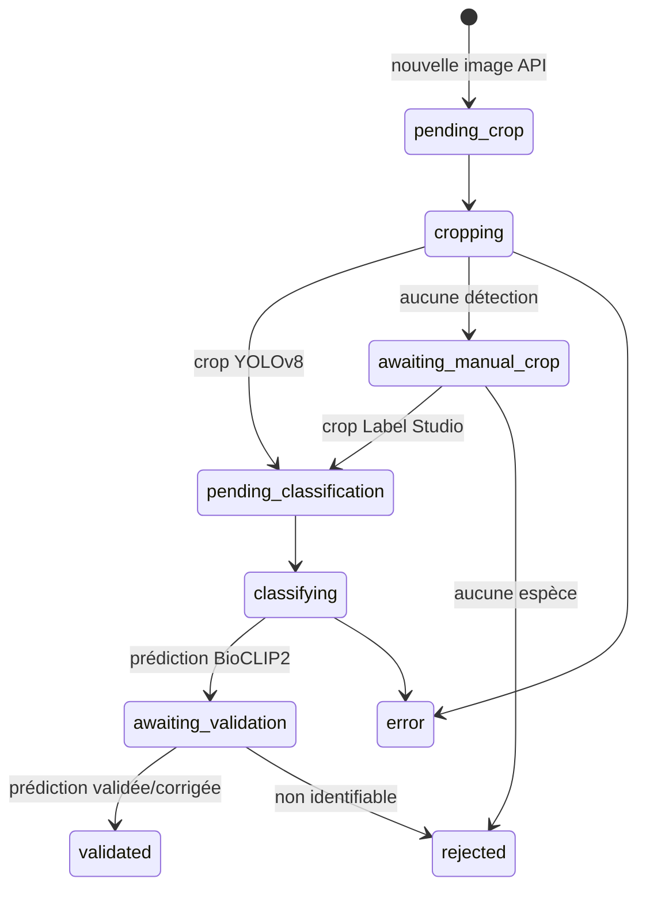

# Architecture de production

## Composants

| Composant | Responsabilité | Persistance |
|---|---|---|
| `backend` | ingestion, crop, classification, synchronisation et nettoyage | aucune locale |
| PostgreSQL | observations, état du traitement et validations | `postgres_data` |
| MinIO/S3 | originaux et crops strictement temporaires | `minio_data` |
| Label Studio | crop manuel et validation taxonomique | `label_studio_data` |
| Metabase | tableaux de bord sur PostgreSQL | `metabase_data` ou volume externe |

Le worker exécute un cycle toutes les `PIPELINE_INTERVAL_SECONDS`. Les modèles
sont chargés une fois, après validation des connexions PostgreSQL, S3 et Label
Studio.

## Machine d'états



Les transitions `cropping` et `classifying` utilisent `FOR UPDATE SKIP LOCKED` :
deux workers ne peuvent pas prendre la même image.

## Tables

### `observations`

Contient les champs normalisés de l'API et `raw_payload` en JSONB. Cette colonne
préserve les champs inconnus sans faire évoluer le schéma à chaque changement
de l'API.

### `processing_images`

Une ligne par image :

- identifiants image/observation et URL source ;
- état courant ;
- URI temporaires de l'original ou du crop ;
- origine du crop (`ml` ou `human`) ;
- prédiction, rang, score, marge et détails ;
- dernière erreur éventuelle.

Une observation avec une seule photo reçoit `id_image = id_observation`. Pour
plusieurs photos : `{id_observation}:{position}`. Les observations déjà marquées
`validee=true` par l'API ne sont pas remises dans la file ML.

### `validated_species`

Résultat définitif produit uniquement par Label Studio : taxon, rang,
identifiabilité, annotateur, date et source de validation.

### `metabase_observations`

Vue joignant les trois tables précédentes. Metabase n'a pas besoin de connaître
la machine d'états interne.

## Cycle des fichiers temporaires

```text
processing/{id_image}/original.jpg  # seulement si YOLOv8 ne croppe pas
processing/{id_image}/crop.jpg      # jusqu'à validation taxonomique
```

- après un crop humain, l'original est supprimé ;
- après validation ou rejet, le crop est supprimé ;
- une passe de nettoyage reprend automatiquement une suppression qui aurait
  échoué après l'écriture PostgreSQL.

PostgreSQL reste donc la seule source de vérité durable.

## Label Studio

Le backend crée deux projets depuis les fichiers XML versionnés :

1. `Biolit - Crop manuel` reçoit l'original quand YOLOv8 ne détecte rien ;
2. `Biolit - Validation taxonomique` reçoit chaque crop et sa prédiction.

Les images sont servies par URL S3 présignée. `S3_PUBLIC_ENDPOINT_URL` doit être
accessible depuis le navigateur des annotateurs, pas seulement depuis le réseau
Docker.

## Erreurs et reprise

Une erreur par image place la ligne dans l'état `error` avec `last_error`; les
autres images du lot continuent. Une reprise volontaire se fait en remettant la
ligne à `pending_crop` ou `pending_classification` dans PostgreSQL après avoir
corrigé la cause.
